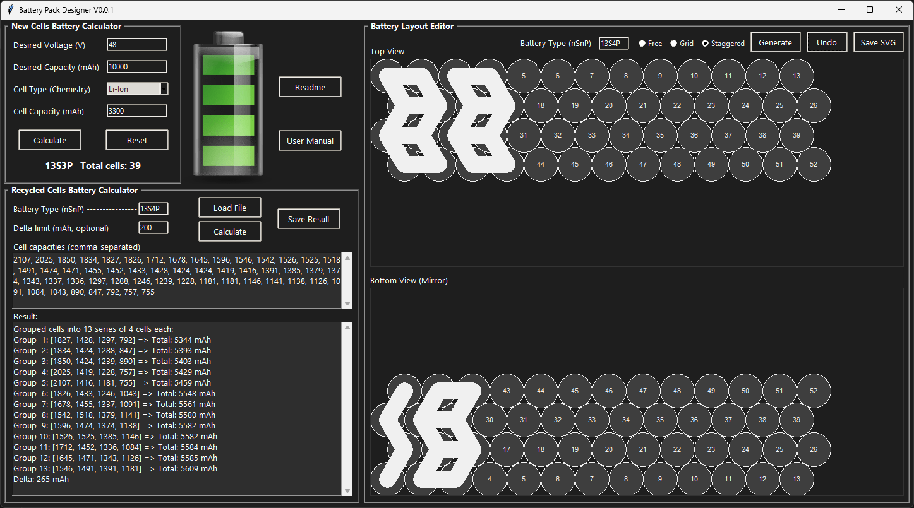

Battery Pack Designer APP 
is a software written in python designed to help with designing any kind of battery pack, from new or recycled lithium, NiMh, NiCd and even Lead Acid cells.
The only requirement is that you need Python 3.12 installed on your system.

